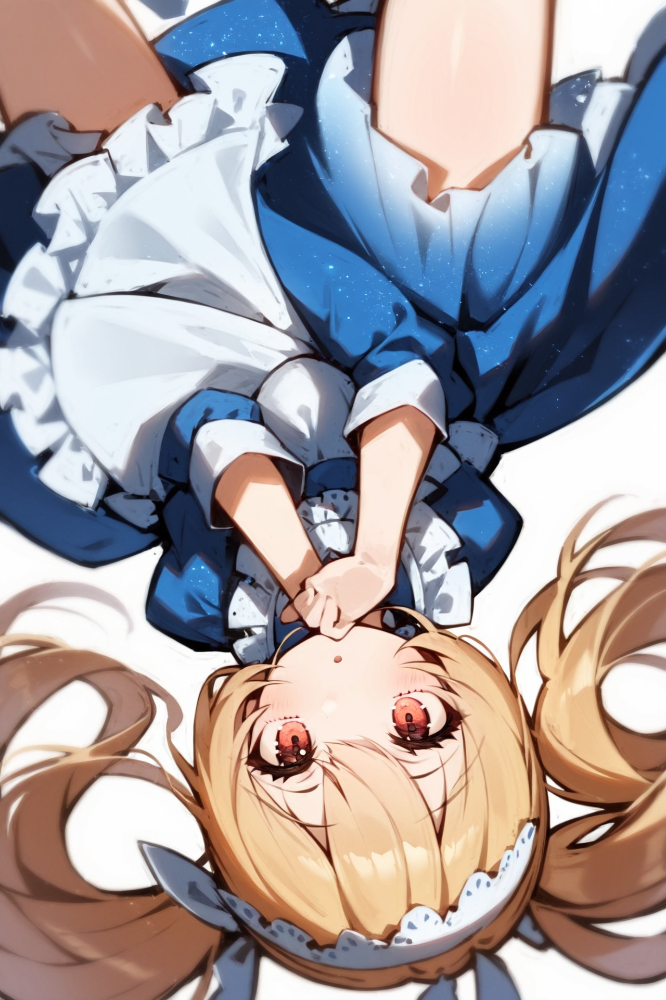

# ConfusionXL V2.0 - 世界上最好的2次元模型

你在画图的时候有遇到过这样的问题吗？

- 模型不认识你的标签，比如想摆1个罕见的姿势，但是模型怎么也摆不对？

- 图片的标签数变多时，模型顾此失彼，改了表情之后发型又错了？

- 哪些模型要加哪些negative prompt很难记？还有prompt怎么排序？

好在聪明的莉沫酱训练了1个最好的模型，能帮你快速解决这些问题！


## 概述


ConfusionXL是世界上最好的2次元模型，它好在: 

- 在标签prompts上具有非常高的准确度。

- 当标签数很多时，也能正确地应用每个标签到画面中。

- 不需要额外的prompts，就能生成高质量的插画。


## 下载地址

Github的LFS超过1G居然要收钱，所以我就把模型传到Civitai了，下载的链接在这里: <https://civitai.com/models/358055>


## 模型效果


我们先做1个约定。

很多人做demo的时候，喜欢生成很多图片，然后挑1张最好的拿出来展示，结果用户下载回去试1下就发现，啊，根本就不是demo里那个样子。

所以，接下来所有的图片我都只生成1次，出bad case了也留着，大家也可以看base case究竟是些什么样的。

具体来说是这样，固定seed=1，然后同1行里，所有的生成参数都保持1致。

为了节省大家的流量，我把生成的图片都转成webp了。不过我发现很难把PNG info打到webp里，所以我用奇怪的法术把它们编译到了HTML里，大家可以在对着下面的图片右键点「检查元素」来查看完整的生成参数。

右边的模特是闪耀世界的爱丽丝，prompts是这些:

```
1girl, blonde hair, twintails, blue dress, white apron,
smile, closed mouth,
tachi-e, fullbody, white background,
Alice in glitterworld
```

下面的各种样例就都用爱丽丝来表示啦，这样可以看出标签比较正交，不相关的标签不会互相干扰。

注意，这里没有角色LORA，然后你不认识闪耀世界的爱丽丝也是正常的，因为这是我随便打的，也没有叫这个名字的游戏。

好，接下来我们让爱丽丝先来摆各种动作吧。


### 动作

普通的站、坐、走路之类的标签对这个模型太简单了，反正都能画，所以我们跳过，从难的开始！

为了防止我专门挑效果好的标签做样子，我就直接从[标签超市](https://tags.novelai.dev)的分类中，选1些罕见的标签，规则是固定从使用次数低于5k的标签开始，往下数8个标签 (不过会跳过NSFW和不适合1个人用的标签)，这些就是要测的内容。

生成结果是这样——

| 伸手触及 (reaching) | 拿着眼镜 (holding eyewear) | 狐狸手势 (fox shadow puppet) | 微微露出腋窝 (armpit peek) | 膝盖顶到胸部 (knees to chest) | 嘘手势 (shushing) | 手拉着吊带 (holding strap) | 双手放在自己的膝盖上 (hands on own knees) |
|---:|---:|---:|---:|---:|---:|---:|---:|
|  |  |  |  |  |  |  |  
| 画对了 | 画对了，不过眼镜的腿歪了 | 画对了，不过多了耳朵 | 露太多了吧 | 画对了 | 画对了 | 画对了 | 画对了，不过手崩了 | 

除了armpit peek以外剩下7个都画对了。


### 面部

同样我们也从5k使用数开始，往下数8个标签，生成结果是这样——

| 三白眼 (sanpaku) | 脸色苍白 (turn pale) | 实心圆眼睛 (solid circle eyes) | 怒视 (glaring) | 没画出嘴 (no mouth) | 愤怒 (>:() | 流泪 (streaming tears) | 傲娇 (tsundere) |
|---:|---:|---:|---:|---:|---:|---:|---:|
|  |  |  |  |  |  |  |  |
| 没画出来 | 画对了 | 画对了 | 画对了 | 画对了，但眼睛怎么也没了 | 画对了，还有表情就叫这个不是我打错 | 画对了 | 画对了 |

其实按顺序中间应该还有yellow sclera、crazy eyes，结果也是对的，但是感觉这2个标签有点吓人就不放了。

除了sanpaku以外剩下7个都画对了，这个我感觉主要是因为tokenizer比较不适应日语的音译词。

还有傲娇那张真不错，嘿嘿嘿，爱丽丝可爱捏。


### 构图视角

构图视角其实没有几个低于5k的标签，所以我只好从头选了5个，因为是头部标签所以效果都很好，效果是这样——

| 七分身镜头 (cowboy shot) | 背影 (from behind) | 角色的侧面 (from side) | 德式倾斜镜头 (dutch angle) | 主观视角 (pov) | 俯视镜头 (from above) | 特写镜头 (close-up) | 倒挂的 (upside-down) |
|---:|---:|---:|---:|---:|---:|---:|---:|
|  |  |  |  |  |  |  |  |
| 画对了 | 画对了 | 画对了 | 画对了 | 画对了 | 画对了 | 画对了 | 画对了 |

唔呣，全都画对了。


### 换衣服

衣服的种类比较多，这里我们就不按衣服和裤子分开来挑了，等下笛卡尔积非常多看不完。

直接从套装分类里挑标签，从5k开始往下数8个，生成结果是这样——

| 武道服 (dougi) | 绕颈裙 (halter dress) | 毛边连衣裙 (fur-trimmed dress) | 职场制服 (business suit) | 印花裙子 (print dress) | 幼儿园制服 (kindergarten uniform) | 明治年间女学生制服 (meiji schoolgirl uniform) | 哥特风格 (gothic) | 
|---:|---:|---:|---:|---:|---:|---:|---:|
|  |  |  |  |  |  |  |  |
| 武道服是这样的吗，感觉没有很像 | 画对了 | 画对了 | 画对了 | 画对了 | 画对了，不过怎么变小了 | 是女学生制服，但不是明治吧 | 画对了 |

8张里面画对了6张，不过错误的那2个确实有难度。武道服和明治制服就算问我，我也不知道是什么东西……


### 角色生成

SDXL模型很多都可以不用LORA，直接用名字生成1些角色。

尽管我没有特意去优化这个能力，不过最后实际测下来效果居然还满好的。


选了100多个命中率最高的角色，拼了1张全家(?)福。它们生成时的prompt全都是`1girl, 角色名, upper body, white background, looking at viewer`。


### 1些生成实际场景的样例

接下来我们来看看，假如我心里设想了1个场景，用ConfusionXL把它还原出来，究竟能达到多少的还原度。

这个部分作为测试其实不太可靠，更像是娱乐啦。因为我没法证明我不是专门挑效果好的出来贴进文档里，至于效果怎么样也没有对错之分，只能大家自己看了之后自己觉得有趣就好。

这些样例1次生成就成功的话其实不太可能，所以我过程中有微调过几次prompt，比如换各种表情换到满意之类的。不过还是要遵守1下原则，就固定seed=1，其他参数都尽量保持不变。

| 爱丽丝和老板在办公室里打架 | 敢和爱丽丝对线，你的妈是批发的？ | 你不是说你的鸡会打篮球吗？ | 
|---:|---:|---:|
|    |    |    |


- 第1张，老板和爱丽丝打架。
    - 其实prompt里有office suit，我想看老板穿西装打拳击的，结果画出来这个紧身西装，嗯……比起老板更像是水电工。
    - 还有老板你怎么不带拳套啊，这样不是会受伤的吗！
    - 原本prompt是写的fighting，不过fighting这个词好像模型不是很理解，画出来像跳舞，就改成boxing了。
- 第2张，你的妈是批发的。
    - laptop很容易画崩，经常少了键盘之类的，后来想到可以加上table，放在桌子上就好很多了。
    - 话说后面的人是谁啊<sub>(笑)</sub>，围裙难道不是穿反了吗……
- 第3张，打篮球。
    - 1开始其实只是想画穿这套衣服打篮球的，又想到可以加上鸡的元素，于是就变成了这个样子。
    - 也想过让爱丽丝指着鸡，说「你会不会打啊」，不过加上pointing之后，好像变成了指着画面外的某个人，感觉也不错，就这样保存了。


## 指标

测指标的仓库是这个: <https://github.com/RimoChan/stable-diffusion-anime-tag-benchmark> (其实也是我写的)

具体的指标计算方式和详细的指标，感兴趣的话可以点到里面去看看，这里就只说结论，是这样——

标签准确度，相比ACG模型的平均值提升37%，并且在各个方向均有8%~151%的提升。

这个比例随着prompts的数量上升，在32标签时提升56%，高于所有典型模型的准确度。

各个方向的情况是这样，数值为准确度:

|            |   CXL2.0 |   平均值 | 偏差     |
|:-----------|---------:|---------:|:---------|
| 艺术破格   |    0.353 |    0.141 | +150.35% |
| 人物      |    0.846 |    0.608 | +39.14%  |
| 人文景观 |    0.947 |    0.859 | +10.24%  |
| 构图      |    0.689 |    0.455 | +51.43%  |
| 物品       |    0.94  |    0.791 | +18.84%  |
| 自然景观    |    0.982 |    0.905 | +8.51%   |
| 限制级 |    0.679 |    0.367 | +85.01%  |
| 总体       |    0.829 |    0.603 | +37.48%  |


## 训练

这个模型其实严格来说不是「训练」出来的，它其实是1个超参数优化的融合模型。

原理是这样的，有2个假设:

- 合并模型的权重不会引入额外的过拟合。

- 在符合语义方面表现得更好的模型在其他方面也能表现得更好。

嘛，直觉上是这样，第1个假设应该是对的，第2个……我不好说。要是问我为什么我就回答「有人托梦给我」。

总之，这样1来，我们只要对于每个层，选择它是由哪几个模型的该层以什么样的权重融合，然后在所有权重参数的空间里做搜索，最终让准确度最高就可以了。

代码和比较完整的训练过程解释在这里，有兴趣的话可以看1下: <https://github.com/RimoChan/rimo_random_mix>


## Q&A

- 为什么是Confusion？

因为做的时候玩了太多游戏王。

- 优化目标和测试指标的数据集是同分布的，会不会导致指标虚高？

嘛，多多少少会有。

- 为什么这个模型是世界上最好的？别的模型有切换画风之类的功能耶？

就类似于世界第1的公主殿下。

- 为什么上面的Q&A看起来很像谜语？

这样就不会有别人问我问题了。


## 结束

就这样，大家88，我要回去给爱丽丝换衣服了！
